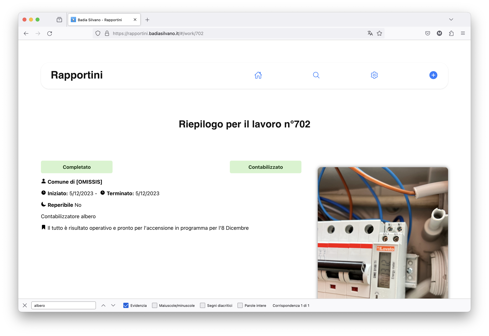

# Fronted of "Rapportini"'s platform
Platform made for the company "Badia Impianti" to keep track of the work done during the days.
The employees can log in and add their job's report, including the time spent on each job and the materials used.  

## Live demo
The platform is hosted on gh-pages and available online at [https://rapportini.badiasilvano.it/](https://rapportini.badiasilvano.it/)

Is possibile to run the platform on your device for testing reason using `npm start` but keep in mind the cors rules, which allow requests only from the original url.
Open [http://localhost:3000](http://localhost:3000) to view it in your browser. All pull requests for improvement are welcome

## Screenshots

